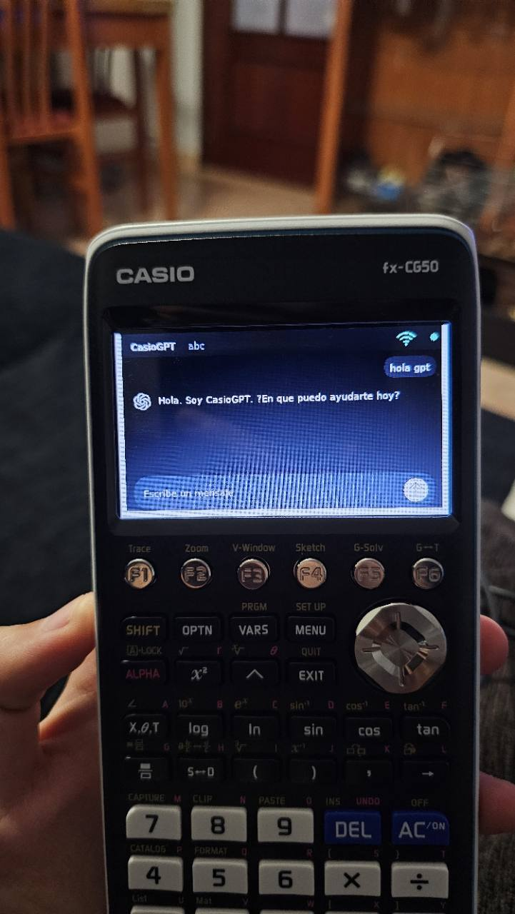
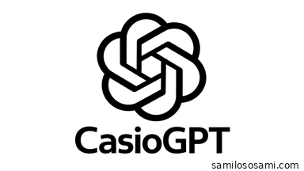
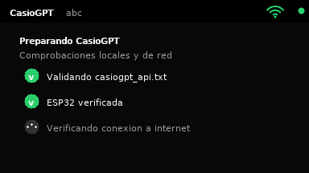
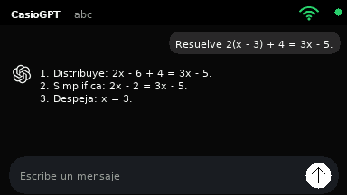
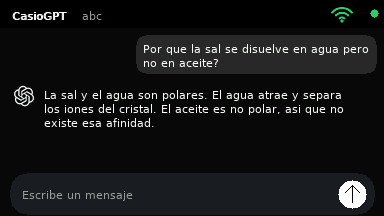
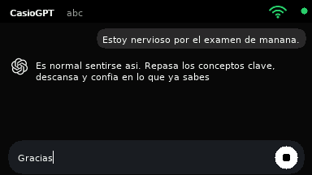
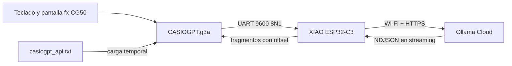

<div align="center">

# CasioGPT

**Un chat con IA en una Casio fx-CG50 real.**

La calculadora dibuja la interfaz y controla la conversación. Una XIAO ESP32-C3
integrada en su interior se ocupa de Wi-Fi, TLS y el streaming desde Ollama Cloud.

[](https://github.com/samilososami/CasioGPT/releases/latest)
[](#requisitos)
[](https://github.com/samilososami/cg50-espmod)
[](LICENSE)



*CasioGPT funcionando físicamente en la fx-CG50 modificada.*

</div>

> [!IMPORTANT]
> CasioGPT es un cliente independiente y no oficial. No está afiliado a Casio,
> OpenAI, ChatGPT, Ollama ni Seeed Studio. El nombre describe el proyecto; la
> versión actual usa Ollama Cloud, no la API de OpenAI.

## Qué hace

CasioGPT convierte la fx-CG50 en un terminal de conversación conectado sin
intentar ejecutar el modelo dentro de la calculadora. El add-in `.g3a` mantiene
la experiencia interactiva —teclado, burbujas, desplazamiento, animaciones y
cancelación— y delega únicamente la red a la ESP32 del proyecto
[`cg50-espmod`](https://github.com/samilososami/cg50-espmod).

- Respuesta visible **fragmento a fragmento**, no al terminar.
- Conversación corta con contexto conservado por el firmware puente.
- Escritura durante la respuesta y cancelación inmediata con **F6**.
- Comprobación guiada de archivo de clave, ESP32, Wi-Fi e Internet.
- API key cargada desde la calculadora, nunca compilada en el `.g3a`.
- Interfaz nativa de **384×216**, diseñada y probada en una fx-CG50.
- Modelo actual: `gemma4:31b`, `think: false`, temperatura `0.10` y hasta 220 tokens.

## La interfaz

<p align="center">
  
  
</p>

<p align="center">
  
  
</p>

<p align="center">
  
</p>

Las capturas anteriores no son mockups web: las genera la misma rutina gráfica
que compila para la calculadora. La fotografía muestra el resultado en hardware.

## Arquitectura



El enlace serie usa frames con checksum FNV-1a, identificadores de petición,
reintentos y offsets. El firmware procesa el NDJSON conforme llega y devuelve
como máximo 64 caracteres por fragmento. Si se repite una petición, el offset
impide duplicar texto. Al cancelar o salir, se cierra la operación y la clave se
borra de la RAM usada por el firmware.

La implementación completa del puente y su protocolo vive en
[`cg50-espmod`](https://github.com/samilososami/cg50-espmod). Este repositorio
publica el cliente CasioGPT de forma independiente para que su código, capturas
y releases no queden enterrados dentro del mod de hardware.

## Ejemplos reales del modelo

La selección del modelo se hizo con seis pruebas de álgebra, porcentajes,
ciencias, historia/lengua, conversación y contexto. `gemma4:31b` obtuvo **15/15**
con thinking desactivado.

| Caso | Resultado resumido | Primer contenido | Total |
|---|---|---:|---:|
| `2(x - 3) + 4 = 3x - 5` | Desarrollo correcto; `x = 3` | 0,378 s | 0,735 s |
| 80 € menos 15 %, después 21 % de IVA | `82,28 €` | 0,353 s | 0,649 s |
| Sal en agua frente a aceite | Explica polaridad e interacción iónica | 0,420 s | 0,876 s |
| Nervios antes de un examen | Respuesta breve, útil y contextual | 0,362 s | 0,696 s |

Estos tiempos pertenecen a la **prueba cloud desde el ordenador**, no a la
latencia total calculadora → UART → ESP32 → Internet → pantalla. Sirven para
comparar modelos en igualdad de condiciones; la experiencia física depende de
la red y del transporte serie. Los resultados completos y las respuestas se
conservan en [`verification/cloud-model-benchmark.json`](verification/cloud-model-benchmark.json).

## Requisitos

1. **Casio fx-CG50** con el mod físico de
   [`cg50-espmod`](https://github.com/samilososami/cg50-espmod).
2. **XIAO ESP32-C3** con el firmware común de ese repositorio.
3. `CASIOWIFI.g3a` para guardar una red antes de abrir el chat.
4. Una API key válida de Ollama Cloud y acceso al modelo configurado.

Otros modelos Casio Prizm podrían aceptar el `.g3a`, pero no se anuncian como
compatibles sin prueba física: resolución, syscalls, memoria y comportamiento
del puerto serie pueden variar.

## Instalación

1. Instala y verifica primero el firmware y CasioWIFI siguiendo
   [`cg50-espmod`](https://github.com/samilososami/cg50-espmod).
2. Descarga `CASIOGPT.g3a` desde la
   [última release](https://github.com/samilososami/CasioGPT/releases/latest).
3. Crea en la raíz de la calculadora un archivo llamado `casiogpt_api.txt` y
   coloca dentro únicamente tu API key. Usa
   [`casiogpt_api.example.txt`](casiogpt_api.example.txt) como referencia.
4. Copia ambos archivos a la raíz de la unidad USB de la fx-CG50.
5. Abre CasioWIFI, conecta una red y después inicia CasioGPT.

En el entorno de desarrollo también puedes usar una copia verificada, con
backup automático del add-in anterior:

```bash
cp casiogpt_api.example.txt casiogpt_api.txt
# Sustituye el texto local por tu clave; este archivo está ignorado por Git.
make install
```

El instalador funciona tanto como `kali` como con UID 0 y nunca imprime la clave.

## Controles

| Tecla | Acción |
|---|---|
| `SHIFT` + `ALPHA` | Bloqueo alfabético de la calculadora |
| `F2` | Alternar minúsculas y mayúsculas |
| `EXE` | Enviar el mensaje cuando la IA está libre |
| `F6` | Cancelar una respuesta en curso |
| `↑` / `↓` | Recorrer la conversación |
| `←` / `→` | Mover el cursor dentro del mensaje |
| `DEL` | Borrar el carácter anterior |
| `AC` | Vaciar el campo de entrada |
| `EXIT` / `MENU` | Cancelar, cerrar UART y salir limpiamente |

## Compilar y probar

Requiere PrizmSDK en `/opt/prizmsdk-linux` o en `$FXCGSDK`, además de GCC,
Python 3 y Pillow:

```bash
make test       # sanitizadores, cinco renders nativos y detección de secretos
make addin      # compila dist/CASIOGPT.g3a
make checksums  # actualiza dist/checksums.txt
make all
```

Más detalles en [`docs/BUILDING.md`](docs/BUILDING.md). La arquitectura y los
límites de confianza están explicados en
[`docs/ARCHITECTURE.md`](docs/ARCHITECTURE.md).

## Estructura

```text
calculator/                         código y recursos del add-in
include/wire.h                      transporte UART compartido
tests/render_ui_test.c              render nativo y estados visuales
verification/cloud-model-benchmark.json
docs/images/                        capturas y fotografía real
dist/CASIOGPT.g3a                   binario publicado
tools/                              build, pruebas e instalación segura
```

## Licencia

Código bajo [MIT](LICENSE). Las marcas mencionadas pertenecen a sus respectivos
propietarios.
